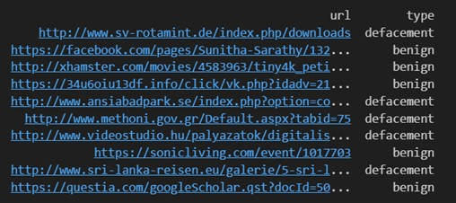
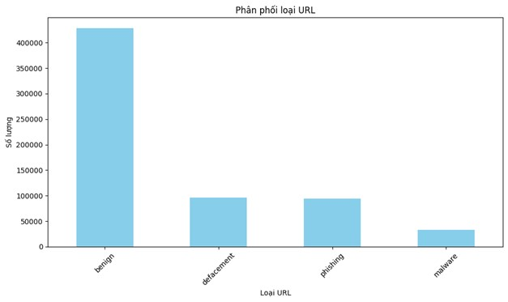
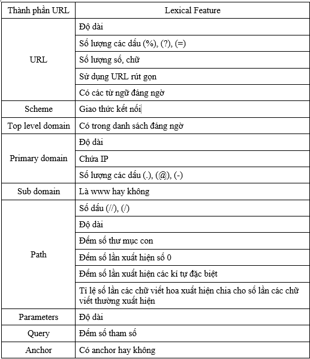
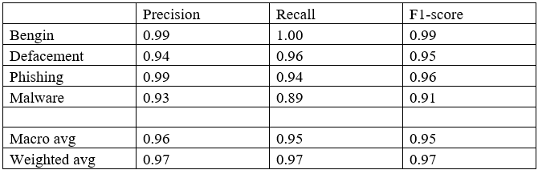
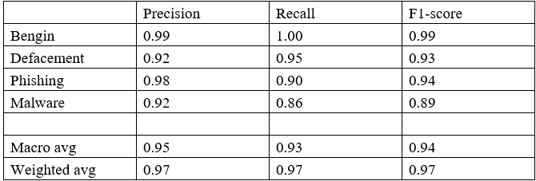
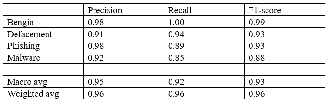

 

Ứng dụng học máy trong phát hiện URL độc hại
**MỤC LỤC**
# CHƯƠNG 1. GIỚI THIỆU ĐỀ TÀI
1.1. [URL là gì?](#url-là-gì)  
1.2. [Một số kỹ thuật tấn công bằng URLs](#một-số-kỹ-thuật-tấn-công-bằng-urls)  

# CHƯƠNG 2. MACHINE LEARNING VÀ MỘT SỐ THUẬT TOÁN TRONG MACHINE LEARNING
2.1. [Giới thiệu về machine learning](#giới-thiệu-về-machine-learning)  
2.2. [Một số thuật toán học máy](#một-số-thuật-toán-học-máy)  
   - 2.2.1. [Random Forest](#random-forest)  
   - 2.2.2. [XGBoost (Extreme Gradient Boosting)](#xgboost-extreme-gradient-boosting)  
   - 2.2.3. [LightGBM (Light Gradient Boosting Machine)](#lightgbm-light-gradient-boosting-machine)  
2.3. [Đánh giá một mô hình học máy](#đánh-giá-một-mô-hình-học-máy)  
   - 2.3.1. [Recall](#recall)  
   - 2.3.2. [Precision](#precision)  
   - 2.3.3. [F-1 Score](#f-1-score)  
   - 2.3.4. [Accuracy](#accuracy)  

# CHƯƠNG 3. THỰC HIỆN ĐỀ TÀI
3.1. [Huấn luyện mô hình](#huấn-luyện-mô-hình)  
   - 3.1.1. [Cơ sở dữ liệu nguồn](#cơ-sở-dữ-liệu-nguồn)  
   - 3.1.2. [Xử lý đầu vào](#xử-lý-đầu-vào)  
3.3. [Kết quả thực nghiệm](#kết-quả-thực-nghiệm)  
   - 3.3.1. [Đánh giá các mô hình](#đánh-giá-các-mô-hình)  
   - 3.3.2. [Xây dựng giao diện mô hình phát hiện URL độc hại](#xây-dựng-giao-diện-mô-hình-phát-hiện-url-độc-hại)  
# TÀI LIỆU THAM KHẢO

 

**LỜI MỞ ĐẦU**

Hiện nay, Học máy (Machine learning) là một trong những lĩnh vực của trí tuệ nhân tạo (AI) được ứng dụng rất nhiều trong rất nhiều mặt của đời sống. Một trong số đó phải kể đến lĩnh vực an toàn thông tin như: Quản lí lỗ hổng bảo mật, Phân tích tệp tĩnh, Phân tích hành vi,… Vì vậy với môn học này, em đã thực hiện đề tài “Ứng dụng học máy trong phát hiện URL độc hại” nhằm mục đích hiểu được cách một chương trình học máy được xây dựng và hoạt động đồng thời ứng dụng chúng trong một vấn đề cụ thể trong lĩnh vực an toàn thông tin.

Sau một thời gian tìm hiểu và thực hiện đề tài này, em đã xây dựng được một chương trình học máy giúp phát hiện và phân loại các URL theo các nhãn BENIGN, PHISING, DEPACEMENT, MALWARE sử dụng mô hình Random Forest.

**CHƯƠNG 1. GIỚI THIỆU ĐỀ TÀI**
 
## 1.1. URL là gì ?

URL viết tắt của Uniform Resource Locator, đơn giản là một địa chỉ dẫn tới một tài nguyên cụ thể và duy nhất trên Web. URL gồm nhiều phần khác nhau, có phần là bắt buộc, có phần là không bắt buộc có (chi tiết ở hình)
.webp "Optional title")

***1-0-1: URL** (nguồn: develop.mozilla.org)*

***a, Scheme (Giao thức kết nối)***

Scheme cho biết giao thức mà trình duyệt sử dụng để yêu cầu tài nguyên. Giao thức là một phương thức được thiết lập cho sự trao đổi hoặc truyền dữ liệu trong mạng máy tính, đối với một website thì các giao thức thường được sử dụng là: HTTPS và HTTP.

***b, Authority***

Authority là phần còn lại của đường dẫn URL nằm đằng sau “**//**” , được chia thành: Subdomain, Domain, Top-Level Domain (TLD). Cụ thể:

**- Subdomain (tên miền phụ)**

[Subdomain](https://seosona.com/subdomain-la-gi/)(hay còn gọi là tên miền phụ) là chuỗi các chữ cái hoặc một từ hoàn chỉnh xuất hiện trước dấu chấm đầu tiên của URL.

Tên miền phụ được công nhận phổ biến nhất là “www”, đại diện cho World WideWeb và cho biết rằng URL là một địa chỉ web. Mặc dù trước đây người ta thường sử dụng “www” nhưng hiện tại nó là tùy chọn và có thể được bỏ qua khỏi URL tùy theo sở thích cá nhân. Ngoài ra còn có các tên miền phụ bổ sung như “blog”, “store”, “support”, “news” và “carreers” được sử dụng để quản lý và sắp xếp các phần khác nhau của trang web với một mục đích cụ thể. Vì Domain và Subdomain có các đặc điểm gần giống với nhau do đó nhiều người nhầm lẫn chúng với nhau. Thực chất là các tên miền có dạng là abc.com còn Subdomain sẽ có dạng như là “suport.abc.com” hay “careers.abc.com”

**– Domain (tên miền)**

Domain là phần chính của một địa chỉ URL để xác định trang web. Giống như Amazon, Wikipedia hay Oleg. Cũng có thể gọi là Primary Domain.
– **Top-Level Domain (TLD)** còn được gọi là phần mở rộng tên miền, đứng sau tên

trang web như:

• *.com* : trang web thương mại

• .*org* : các tổ chức phi lợi nhuận

• *.net* : các công ty phần mềm và dịch vụ lưu trữ cung cấp dịch vụ mạng

• *.gov* : các cơ quan, ban ngành chính phủ

Tên miền cấp cao theo mã quốc gia (ccTLD), là phần mở rộng tên miền gồm hai chữ cái cho biết mối liên kết của trang web với một quốc gia hoặc lãnh thổ cụ thể.

Ví dụ như là:
.vn : dành cho Việt Nam

.uk : cho Vương quốc Anh

.de : cho Đức

.in : dành cho Ấn Độ

.au dành cho Úc

.ca dành cho Canada

.nz dành cho New Zealand

***c, Port (Cổng giao tiếp)***

Cổng được sử dụng để truy cập vào tài nguyên của máy chủ Web

• HTTP là 80

• HTTPS là 443

***d, Path to resource (Đường dẫn)***

Đường dẫn tới tài nguyên của máy chủ Web, bắt đầu bằng dấu gạch chéo. Những dấu gạch chéo này sẽ tiếp tục thể hiện phân chia giữa các thư mục và thư mục con

\- (Subfolder) Thư mục con là một thư mục tồn tại trong thư mục cấp cao nhất hoặc chính của hệ thống phân cấp trang web.

\- Slug là một phần của URL xác định một trang hoặc bài đăng cụ thể trên một trang web. Mục đích của nó là giúp người dùng hiểu rõ hơn về ngữ cảnh và nội dung của trang. Ví dụ: xét slug của một URL: “/url-nghĩa-cấu trúc-và-tối ưu hóa-tips/”. Chỉ cần nhìn vào slug, người dùng có thể hiểu được nội dung của trang. Tuy nhiên, đôi khi ta có thể gặp phải các URL slug trông như thế này:
“/123456/”. Slug có số có thể gây nhầm lẫn cho người dùng.

***e, Parameters (Tham số)***

Query string (Chuỗi truy vấn), còn được gọi là URL parameter (tham số URL), là một phần của URL theo sau dấu chấm hỏi (?). Chúng bao gồm các cặp khóa - giá trị được phân tách bằng dấu bằng (=). Khóa cho biết loại thông tin nào đang được truyền đi, trong khi giá trị đại diện cho dữ liệu thực tế. Bạn có thể bao gồm nhiều tham số trong một URL bằng cách phân tách chúng bằng dấu và (&). Chuỗi truy vấn được sử dụng cho nhiều mục đích khác nhau, bao gồm:

\- Các tham số tìm kiếm cho phép người dùng tìm kiếm kết quả của công cụ tìm kiếm nội bộ của trang web.

\- Lọc các tham số cho phép người dùng sắp xếp và lọc danh sách trên các trang danh mục theo nhiều thuộc tính khác nhau như giá cả, tình trạng còn hàng, kích thước, thương hiệu, vị trí và xếp hạng.

\- Các thông số theo dõi hỗ trợ theo dõi lưu lượng truy cập từ các chiến dịch và

quảng cáo tiếp thị.

\- Các tham số phân trang giúp tổ chức các trang lưu trữ blog và các chủ đề diễn đàn thành một chuỗi trang.

***f, Anchor***

"Anchor" trong URL đề cập đến phần địa chỉ web nằm sau ký hiệu '#'. Nó còn được gọi là "fragment identifier". Anchor (neo) thường không đề cập đến một tài nguyên cụ thể trên máy chủ mà được sử dụng để điều hướng đến một phần cụ thể trong trang web.

Ví dụ: trong URL https://viccisw.com/page#section, phần #section là điểm neo. Khi URL này được truy cập, trình duyệt web thường sẽ cuộn xuống phần trang web được xác định bởi anchor, miễn là trang web đó có một phần tử có thuộc tính ID hoặc tên tương ứng với giá trị của anchor. Anchor thường được sử dụng để hướng người dùng đến một phần cụ thể của trang web, đặc biệt là trong các tài liệu hoặc bài viết dài hơn, bằng cách liên kết trực tiếp đến một phần cụ thể trong trang.

## 1.2. Một số kĩ thuật tấn công bằng URLs ?**]

Kĩ thuật tấn công là những phương thức hoặc cơ chế được sử dụng bởi kẻ tấn công để có truy cập trái phép vào dữ liệu của người dùng hoặc gây ra tổn hại đến hệ thống bị tấn công. Kẻ tấn công có thể sử dụng URLs độc hại để triển khai việc tấn công trên. URLs độc hại có thể được phân loại thành spam, phishing, malware hoặc defacement URLs. Phần lớn các cuộc tấn công mạng xảy ra khi người dùng nhấp vào các URL độc hại. Khi URL bị khai thác cho các mục đích khác ngoài việc truy cập các tài nguyên hợp pháp trên Internet, chúng sẽ gây ra mối đe dọa đối với tính toàn vẹn, bảo mật và tính khả dụng của dữ liệu [1]. Trong đề tài này thực hiện phân loại các URL thành bengin, phishing, malware, defacement. Sau đây là chi tiết về các loại URL này

***a, Bengin URLs***

Là url an toàn, người dùng có thể sử dụng để truy cập các tài nguyên trên Internet.

***b, Phishing URLs***

Kẻ tấn công sử dụng Phishing URLs để tấn công những người đã ấn vào và mở ra một website giả, nhằm đánh cắp các thông tin riêng tư của người dùng như số thẻ tín dụng,… bằng cách truy cập vào máy tính của họ. Người dùng mà không phải là chuyên gia có thể dễ dàng bị mắc bẫy và nhấp vào các phishing website mà URL có một vài lỗi chính tả khó phát hiện như www.facebook.com bị thay thành www.facebo0k.com, việc này khiến dữ liệu người dùng dễ bị xâm nhập hơn.[2]

***c, Malware URLs***

URL này dẫn người dùng tới một trang web độc hại mà điển hình là cài đặt phần mềm độc hại (malware) lên thiết bị của người dùng, từ đó thiết bị của người dùng có thể bị khai thác nhằm làm hỏng các tệp tin, hoặc bị ghi lại các thao tác trên bàn phím (keystroke logging) thậm chí là đánh cắp danh tính. [3]

***d, Defacement URLs***

Defacement URL chuyển hướng người dùng tới một trang web đã bị tin tặc thay đổi ở một hoặc nhiều khía cạnh như giao diện hay một số nội dung của trang web.[4] Kiểu tấn công này xảy ra khi kẻ tấn công phát hiện ra một lỗ hổng của website và lợi dụng nó nhằm gây hại cho website và sửa đổi nội dung trên trang web mà không có sự cho phép của chủ sở hữu. Về mặt kĩ thuật thì việc này gọi là xâm nhập một trang web.[2]

**CHƯƠNG 2. MACHINE LEARNING VÀ MỘT SỐ THUẬT TOÁN TRONG MACHINE LEARNING**

[**2.1. Giới thiệu về machine learning**](#giới-thiệu-về-machine-learning) 

Machine learning (Học máy) là 1 nhánh con của trí tuệ nhân tạo (AI) và khoa học máy tính. Machine learning sử dụng data, thuật toán đầu vào để tự xử lý các vấn đề và liên tục tối ưu để tạo ra những phương án xử lý mới, hiệu quả hơn; giống như cách thức tự học của não bộ con người.[4]
Thống kê và dự đoán là 2 mục đích chính của việc áp dụng machine learning vì thế hệ thống này được thiết kế với khả năng tự nghiên cứu, cải tiến bản thân dựa trên những nguyên lý được lập trình ban đầu. Trong nhiều trường hợp machine learning sẽ tự đề xuất ra giải pháp tối ưu mà không cần được lập trình trước.[4]Machine learning sử dụng data, thuật toán đầu vào để tự xử lý các vấn đề và liên tục tối ưu để tạo ra những phương án xử lý mới, hiệu quả hơn; giống như cách thức tự học của não bộ con người.[4]

Thống kê và dự đoán là 2 mục đích chính của việc áp dụng machine learning vì thế hệ thống này được thiết kế với khả năng tự nghiên cứu, cải tiến bản thân dựa trên những nguyên lý được lập trình ban đầu. Trong nhiều trường hợp machine learning sẽ tự đề xuất ra giải pháp tối ưu mà không cần được lập trình trước.[4]

**Quá trình “tự học” của Machine Learning**

Về tổng thể thì quá trình này sẽ đi từ xác định vấn đề, rà soát các phương án có sẵn từ bộ dữ liệu đầu vào để trả ra kết quả tương thích. Sau mỗi lần xử lý, machine learning có khả năng đánh giá và đúc kết kinh nghiệm để làm “giàu” thêm bộ dữ liệu được lập trình ban đầu.[4]

***2-1: Quá trình học của Machine Learning***

*(Nguồn: https://som.edu.vn/machine-learning-la-gi-phan-loai-quy-trinh-ung-dung/)*

Quá trình này là 1 chuỗi khép kín, vận hành và chuyển hóa liên tục. [4]

**Bước 1. Xử lý dữ liệu đầu vào.**

Dữ liệu thô sẽ được chọn lọc để loại bỏ phần thừa, sắp xếp dữ liệu theo nhóm có cấu trúc nhất định. Dữ liệu thô trong từng bối cảnh sẽ khác nhau và thường rất “rối” nhưng với cơ chế sàng lọc, machine learning có thể tự gỡ rối. Cơ chế này giúp nhận dạng những dữ liệu quan trọng, nhóm chúng lại và cắt bỏ những dữ liệu rác để hạn chế chi phí xử lý.[4]

**Bước 2. Sử dụng thuật toán để chọn ra những phương án tối ưu nhất.**

Những dữ liệu đã được phân theo nhóm được đưa vào “dây chuyền” xử lý để phân tích, kết hợp lại để tạo nên các phương án mà machine learning cho rằng phù hợp với vấn đề hiện tại. Hiểu đơn giản thì đây là lúc hệ thống tổ hợp các dữ liệu đầu vào, vận dụng thuật toán để hình thành, đánh giá và chọn ra những phương án khả thi nhất.[4]

Những ứng cử viên nặng ký còn lại sau quá trình đánh giá sẽ được kiểm nghiệm trong các điều kiện giả định của yêu cầu đầu vào. Một lần nữa, các phương án lộ ra các yếu điểm sẽ bị loại bỏ. Kết quả xuất ra chính là phương án sau (nhiều) thử nghiệm có thể trụ lại mà machine learning cho rằng phù hợp nhất với “bài toán” đang giải.[4]

**Bước 3. Triển khai phương án tốt nhất và tiếp tục cải thiện.**

Phương án cuối cùng sẽ được triển khai trong thực tế và trong quá trình triển khai machine learning tiếp tục ghi nhận những vấn đề phát sinh, kể cả ưu và nhược điểm mà khi kiểm nghiệm chưa phát hiện ra. Sau đó, hệ thống quay lại cập nhật cho bộ dữ liệu ban đầu cách xử lý để có những phương án chuẩn xác hơn theo thời gian.[4]

Sau nhiều lần cập nhật, machine learning sẽ hình thành tiêu chuẩn cho những phương án trả ra để hướng tới phương án tốt nhất, với tốc độ xử lý nhanh, ít sai sót và rủi ro hơn.[4]

**Các phân loại của Machine Learning**

Machine Learning vẫn chưa thể tách biệt khỏi con người. Tuy nhiên, tùy theo phân loại mà mức độ tham gia của con người trong quá trình vận hành của sẽ khác nhau. Cụ thể thì Machine Learning có 3 phân loại như sau:

1\. **Supervised learning - Học có giám sát**: Con người sẽ lập trình dữ liệu đầu vào bao gồm cả cách thức và phương án mà con người mong muốn. Phương án và đáp án sẽ được gắn nhãn, sắp xếp sẵn và Machine Learning chỉ cần rà soát và trả ra đúng kết quả có trong bộ dữ liệu đã có. Tin nhắn rác đến từ 1 số nguồn sẽ tự động được tách ra khỏi hộp thư chính là ứng dụng của machine learning giúp phân loại tin nhắn trên email.[4]

2\. **Unsupervised learning - Học không giám sát**: Machine learning chỉ được cung cấp các thuật toán, công cụ để tự xử lý mà không biết trước kết quả. Dễ thấy nhất việc ứng dụng của phân loại này đó là cá nhân hóa trải nghiệm khách hàng.Dữ liệu đầu vào bao gồm hành vi, lịch sử mua mua hàng và hệ thống sẽ dự đoán những sản phẩm phù hợp và đề xuất riêng cho từng khách hàng.[4]

3\. **Semi-supervised learning- Học bán giám sát**: Đây là phân loại nằm ở giữa của 2 phân loại trên khi này dữ liệu đầu vào là 1 hỗn hợp bao gồm cả phương pháp lẫn đáp án. Điểm khác biệt ở đây là phương án và đáp án chưa được nhóm lại thành từng bộ. Như vậy machine learning phải tự tìm ra cách giải nào tương thích với đáp án nào trong bộ dữ liệu sẵn có.[4] Semi-supervised learning thường được doanh nghiệp ứng dụng trong khảo sát thị trường. Trước khi ra mắt sản phẩm mới, họ đưa ra các kết quả giả định về phản ứng của người tiêu dùng. Sau đó, họ sử dụng machine learning trong quá trình khảo sát để kiểm chứng xem giả định nào là đúng. Nhờ đó, doanh nghiệp có thể điều chỉnh sản phẩm, nhắm đến đối tượng mục tiêu phù hợp và dễ thành công hơn khi chính thức ra mắt.[4]

**2.2. Một số thuật toán học**

Trước khi nói đến các thuật toán học trong Học máy, ta sẽ đề cập đến một số các khái niệm liên quan để có thể hiểu rõ hơn :

**Học kết hợp (Emsemble learning)**

Là một kĩ thuật học có giám sát kết hợp nhiều mô hình để đưa ra một mô hình hiệu quả và mạnh mẽ hơn từ đó làm giảm khả năng xảy ra overfiting với các dữ liệu huấn luyện.

**Cây quyết định (Decision tree)**

***2-0-1: Decision tree (** Nguồn : https://www.ibm.com/topics/decision-trees)*

Cây quyết định là một cấu trúc cây giống như sơ đồ trong đó mỗi nút bên trong biểu thị tính năng, các nhánh biểu thị các quy tắc và các nút lá biểu thị kết quả của thuật toán. Nó là một thuật toán học máy có giám sát (supervised machine learning) linh hoạt, được sử dụng cho cả các bài toán phân loại và hồi quy. Đây là một trong những thuật toán rất mạnh mẽ. Internal node đại diện cho một thuộc tính để kiểm tra dữ liệu sắp tới. Mỗi nhánh/cây con của 1 node tương ứng với một giá trị của thuộc tính của node đó. Mỗi leaf node biểu thị một nhãn lớp hoặc một giá trị số. Mỗi đường đi từ root node đến leaf node là một sự kết hợp của các lần kiểm tra Cây quyết định tạo ra một mô hình dự đoán nhãn bằng cách đánh giá cây câu hỏi đặc trưng if-then-else đúng/sai và ước tính số lượng câu hỏi tối thiểu cần thiết để đánh giá xác suất đưa ra quyết định đúng. Cây quyết định có thể được sử dụng để phân loại nhằm dự đoán một danh mục hoặc hồi quy để dự đoán một giá trị số liên tục.

**Bagging classifier**

Là một kĩ thuật trong emsemble learning mà rất nhiều các mô hình cơ sở được huấn luyện độc lập và song song trên các tập con của tập dữ liệu huấn luyện. Mỗi tập con dữ liệu được tạo ra bằng việc sử dụng bootstrap sampling, mỗi quan sát hay mỗi mẫu được chọn một cách ngẫu nhiên có thể thay thế, tức là một mẫu có thể xuất hiện lặp lại trong nhiều tập dữ liệu huấn luyện con. Dự đoán cuối cùng được tổng hợp từ tất cả các dự đoán của các mô hình cơ sở.

***2-3: Bagging Classifier** (Nguồn: https://www.geeksforgeeks.org/xgboost/)*

**Boosting**

Là một kĩ thuật, mô hình kết hợp nhằm xây dựng một bộ phân loại mạnh từ những bộ phân loại kém. Mô hình được xây dựng theo một chuỗi các mô hình kém hơn, đầu tiên một mô hình được xây dựng từ dữ liệu huấn luyện, sau đó mô hình thứ hai được xây dựng sau đó nhằm cố gằng sửa đổi những lỗi sai từ mô hình đầu tiên, liên tục như vậy cho đến khi dữ liệu huấn luyện được dự đoán đúng hoặc số các mô hình được đưa vào đã đạt đến giá trị max.

***2-4: Boosting** (Nguồn: https://www.geeksforgeeks.org/xgboost/)*
**Gradient Boosting**

Gradient Boosting là một thuật toán Boosting phổ biến. Mỗi bộ dự đoán (predictor) sẽ sửa lỗi của bộ dự đoán trước đó.

**2.2.1. Random Forest**

Random forest là một phương pháp học kết hợp trong machine learning cho các bài toán phân loại (classification), hồi quy (regression) và một số bài toán khác. Đưa ra dự đoán dựa vào sự kết hợp từ rất nhiều cây quyết định (decision trees) được xây dựng song song trong quá trình học bằng việc lấy trung bình tất cả các dự đoán.

**Cách hoạt động của mô hình Random Forest:**

**Tạo ra nhiều cây quyết định:** Random Forest tạo ra một tập hợp các cây quyết định độc lập. Mỗi cây sẽ được huấn luyện trên một tập dữ liệu con được lấy mẫu từ tập dữ liệu huấn luyện thông qua phương pháp lấy mẫu ngẫu nhiên với hoặc không thay đổi (bootstrap sampling).

**Đa dạng hóa các cây quyết định:** Các cây quyết định được xây dựng dựa trên một số lượng đặc trưng ngẫu nhiên được chọn ở mỗi node (phần tử) trong quá trình xây dựng cây. Điều này giúp tạo ra sự đa dạng giữa các cây và ngăn chặn việc overfitting.

**Tính toán dự đoán:** Khi có một điểm dữ liệu cần dự đoán, mỗi cây sẽ cho ra một dự đoán riêng. Kết quả cuối cùng sẽ được xác định thông qua việc bầu chọn (voting) từ tất cả các cây. Trong trường hợp phân loại, lớp được chọn sẽ là lớp đa số được bầu chọn từ các cây.

**2.2.2. XGBoost (Extreme Gradient Boosting)**

XgBoost là một triển khai của Gradient Boosting đối với cây quyết định. Trong thuật toán này, cây quyết định được tạo ra dưới dạng tuần tự. Trọng số đóng một vai trò quan trọng trong XGBoost. Trọng số được gán cho tất cả các biến độc lập mà được đưa vào cây quyết định để dự đoán kết quả. Trọng số của biến được dự đoán sai bởi cây quyết định sẽ bị tăng lên sau đó được đưa vào cây dự đoán thứ hai. Những bộ phân loại/ bộ dự đoán sau đó sẽ tổng hợp lại để tạo ra một mô hình mạnh mẽ và chính xác.

**2.2.3. LightGBM (Light Gradient Boosting Machine)**

LightGBM là gradient-boosting framework dựa trên decision trees để tăng hiểu quả của mô hình đồng thời giảm dung lượng bộ nhớ cần dùng, sử dụng hai kĩ thuật mới:

Gradient-based One Side Sampling(GOSS)
Exclusive Feature Bundling (EFB)

Các kỹ thuật này đáp ứng các hạn chế của thuật toán dựa trên biểu đồ được sử dụng chủ yếu trong tất cả các khung GBDT (Gradient Boosting Decision Tree). LightGBM phân chia cây theo lá, trái ngược với các thuật toán boosting khác phát triển theo cấp độ cây. Nó chọn lá có độ mất delta tối đa để phát triển. Vì lá được cố định nên thuật toán theo lá có tổn thất thấp hơn so với thuật toán theo cấp độ. Sự phát triển của cây theo lá có thể làm tăng độ phức tạp của mô hình và có thể dẫn đến việc trang bị quá mức trong các tập dữ liệu nhỏ.

*2-4: Cấu trúc của LightBGM*

*(Nguồn: https://www.geeksforgeeks.org/lightgbm-light-gradient-boosting-machine/*

**2.3. Đánh giá một mô hình học máy**

\- **True positives**: Các điểm Positive thực được nhận Đúng là Positive

\- **False positives**: Các điểm Negative thực được nhận Sai là Positive

\- **True negatives**: Các điểm Negative thực được nhận Đúng là Negative

\- **False negatives**: Các điểm Positive thực được nhận Sai là Negative

**2.3.1.Recall:**

Recall đo lường tỷ lệ của các trường hợp dự đoán true positive so với tổng số trường hợp thực sự thuộc vào positive class. Recall rất hữu ích khi xử lý các tập dữ liệu mất cân bằng trong đó một class (positive hoặc negative) chiếm ưu thế hơn class kia vì nó tập trung vào khả năng của mô hình trong việc tìm kiếm các đối tượng của class mục tiêu.

**2.3.2. Precision**

Precision là thước đo tần suất mô hình học máy dự đoán chính xác positive class. Bạn có thể tính toán độ chính xác bằng cách chia số lượng dự đoán TruePositive cho tổng số trường hợp mà mô hình dự đoán là positive. Và khi đó 0< Precision <=1, Precision càng lớn có nghĩa là độ chính xác của các điểm tìm được càng cao.

**2.3.3. F-1 Score**

Trong thực tế nếu điều chỉnh model để tăng Recall quá mức có thể dẫn đến Precision giảm và ngược lại, cố điều chỉnh model để tăng Precision có thể làm giảm Recall. Làm sao để cân bằng 2 đại lượng này. Vậy thì bài toán mới được đặt ra là: giả sử chúng ta đang xây dựng một tập các model (để sau đó chọn ra model tốt nhất). Và chúng ta như “đứng giữa 2 con đường” khi lựa chọn các model sao cho cân bằng giữa Precision và Recall. Nhưng thật may có thêm một tham số nữa dung hòa giữa 2 cái và ta có thể căn vào đó để lựa chọn, đó là F-1 Score:

Đến đây ta có thể căn cú vào F1 để chọn model, F1 càng cao thì càng tốt. Khi lý tưởng nhất thì F1 = 1 (khi Recall = Precision=1).

**2.3.4. Accuracy**

Accuracy (độ chính xác) trong machine learning là một trong những metric cơ bản để đánh giá hiệu suất của mô hình phân loại (classification model). Độ chính xác đánh giá khả năng của mô hình trong việc dự đoán đúng các nhãn/labels của dữ liệu kiểm thử. Nó là tỷ lệ giữa số lượng các dự đoán đúng và tổng số lượng các dự đoán được thực hiện trên tập dữ liệu kiểm thử.

Ưu điểm:

1\. **Dễ hiểu và giải thích:** Độ chính xác là một metric đơn giản và dễ hiểu, có thể giải thích một cách trực quan cho người không chuyên về machine learning.

2\. **Phản ánh tổng quát về hiệu suất:** Độ chính xác cung cấp cái nhìn tổng quát về tỷ lệ dự đoán chính xác của mô hình trên toàn bộ dữ liệu kiểm thử.

3\. **Thích hợp cho dữ liệu cân bằng:** Đối với các bài toán có sự cân bằng giữa các nhãn (labels) trong tập dữ liệu, accuracy thường là một metric hữu ích. Tuy nhiên, nhược điểm của độ đo này là không phản ánh chính xác trong tập dữ liệu mất cân bằng (một số nhãn xuất hiện nhiều hơn so với những nhãn khác) do accuracy không phản ánh chính xác về hiệu suất của mô hình vì mô hình có thể dự đoán tốt trên nhãn phổ biến nhưng không tốt trên các nhãn ít xuất hiện Ngoài ra còn 1 số thông số dùng để dánh giá khác:

**Micro-average (Micro):**

Tính toán số liệu (precision, recall, F1-score) bằng cách tính tổng số True Positives, False Positives và False Negatives trên toàn bộ các lớp, sau đó tính toán metric từ tổng này.

Micro-average phù hợp khi bạn muốn xem xét hiệu suất trên toàn bộ dữ liệu mà không quan trọng đến sự chênh lệch giữa các lớp.

**Macro-average (Macro):**

Tính toán số liệu riêng cho mỗi lớp, sau đó lấy trung bình của các metric này. Macro-average đưa ra trung bình không trọng số của hiệu suất trên từng lớp, tức là mỗi lớp có cùng trọng số khi tính toán metric.

**Weighted Average (Weighted):**

Tính toán số liệu riêng cho mỗi lớp, sau đó lấy trung bình có trọng số của các metric này dựa trên số lượng mẫu của từng lớp. Weighted-average quan trọng hơn các lớp có số lượng mẫu lớn hơn khi tính toán metric.

**CHƯƠNG 3. THỰC HIỆN ĐỀ TÀI**

**3.1. Huấn luyện mô hình**

**3.1.1. Cơ sở dữ liệu nguồn**

**Nguồn dữ liệu**: dựa vào bộ dữ liệu của tác giả MANU SIDDHARTHA đăng trên trang web <https://www.kaggle.com/>nhưng có chỉnh sửa lại các URL sao cho đầy đủ giao thức kết nối (HTTP, HTTPS,…) để có thể phù hợp với bài toán

**Mô tả dữ liệu**: Dữ liệu gồm 2 trường url và type, tổng có 651191 mẫu đã được gắn nhãn là bengin, malware, defacement và phishing với phân phối như hình bên

***3-1: Dataset***

***3-2: Trực quan hóa dữ liệu***

**3.1.2. Xử lí đầu vào**

Bước đầu tiên trong việc xây dựng mô hình phân loại là trích xuất các đặc trưng cho mô hình. Thuật toán học máy chỉ có thể hoạt động với đầu vào số. Do đó, các chuỗi URL cần được mã hóa thành các vectơ số có ý nghĩa. Ta sẽ trích xuất các feature từ URL từ data từ đó giúp mô hình có thể dựa vào đó để được huấn luyện. Trong đề tài này, URL sẽ có tổng cộng 28 feature được liệt kê sau đây:

**3.3. Kết quả thực nghiệm**

**3.3.1. Đánh giá các mô hình**

**Đối với mô hình Random Forest:**

Accuracy : 0.9734

**Đối với mô hình Boost:**

Accuracy : 0.9671

**Đối với mô hình XGBoost:**

Accuracy : 0.9637

**3.3.2. Xây dựng giao diện mô hình phát hiện URL độc hại**

**Thuật toán học: Random forest**

Sau khi thực hiện đánh giá độ chính xác của 3 mô hình trên thì mô hình Random Forest cho thấy những thông số tốt hơn so với 2 mô hình còn lại. Ngoài ra, các thuật toán đóng bao (Random Forest trong trường hợp này) rất phù hợp cho chương trình này vì chúng tính trung bình nhiều dự đoán được đào tạo trên các phần khác nhau của dữ liệu đào tạo, với mục tiêu giảm phương sai. Độ trễ thấp được đảm bảo vì các đặc điểm từ vựng là dẫn xuất trực tiếp của chuỗi URL và do đó tính toán rất hiệu quả. [5] Random forest với các công cụ ước tính Cây quyết định được chọn làm mô hình để phân loại.

**Công cụ xây dựng giao diện cho chương trình: Flask**

Flask là một framework web siêu nhẹ dành cho ngôn ngữ lập trình Python. Nó được thiết kế để giúp việc xây dựng ứng dụng web trở nên dễ dàng và nhanh chóng thông qua việc cung cấp các công cụ và thư viện linh hoạt. Dưới đây là một số đặc điểm chính của Flask:

1\. **Đơn giản:** Flask có cú pháp dễ hiểu và sử dụng, cho phép người phát triển bắt đầu nhanh chóng mà không cần nhiều kiến thức trước.

2\. **Tùy biến cao:** Flask cho phép mở rộng và tùy chỉnh linh hoạt, giúp người dùng thêm hoặc loại bỏ các thành phần theo nhu cầu cụ thể.

3\. **Tối giản:** Flask được thiết kế theo nguyên tắc giữ cho mọi thứ đơn giản. Nó cung cấp chỉ những công cụ và tính năng cần thiết để xây dựng ứng dụng web, nhưng vẫn có thể mở rộng thông qua các extension.

**Giao diện của website đưa ra dự đoán về một URL :**

**Cách hoạt động :**

B1 : Nhập một URL vào form

B2 : Click vào nút Submit để chương trình đưa ra dự đoán

**TÀI LIỆU THAM KHẢO**

[1] T. Manyumwa, P. F. Chapita, H. Wu, and S. Ji, ‘‘Towards fighting cybercrime: Malicious URL attack type detection using multiclass classification,’’ in Proc.IEEE Int. Conf. Big Data (Big Data), Dec. 2020, pp. 1813–1822, doi: 10\.1109/BIGDATA50022.2020. 9378029

[2] C. Johnson, B. Khadka, R. B. Basnet, and T. Doleck, ‘‘Towards detecting and classifying malicious URLS using deep learning,’’ J. Wireless Mob. Netw., Ubiquitous Comput. Dependable Appl., vol. 11, no. 4, pp. 31–48, Dec. 2020, doi: 10\.22667/JOWUA.2020.12.31.031.

[3] M. Cova, C. Kruegel, and G. Vigna, ‘‘Detection and analysis of drive-by-download attacks and malicious Javascript code,’’ in Proc. 19th Int. Conf. World Wide Web (WWW), 2010, pp. 281–290, doi: 10.1145/1772690.1772720.

[4] Machine Learning là gì? Khái niệm, phân loại và ứng dụng của Machine Learning https://som.edu.vn/machine-learning-la-gi-phan-loai-quy-trinh-ung-dung/

[4] Hacktivism and Website Defacement: Motivations, Capabilities and Potential Threats. Accessed: Nov. 25, 2021. [Online]. Available: https://www.researchgate.net/publication/320330579\_Hacktivism\_and\_Website\_Defacement\_Motivations\_Capabilities\_ and\_Potential\_Threats

[5] Apoorva Joshi, Levi Lloyd, Paul Westin, Srini Seethapathy “Using Lexical Features for Malicious URL Detection - A Machine Learning Approach’, pp. 3-4, 14 Oct 20219, doi: 1910.06277
